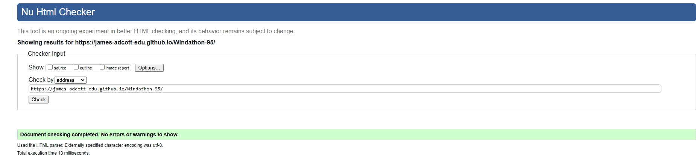
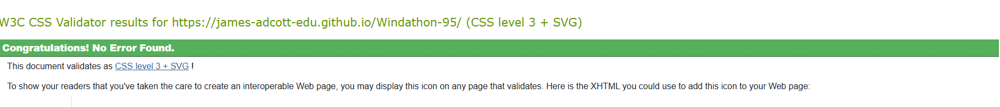

# Windathon-95 - Our hackathon project

A faithful recreation of the Windows 95 operating system in vanilla JavaScript, running entirely in the browser.


You can view the live site [here](https://james-adcott-edu.github.io/Windathon-95/).

## 🚀 Features

- Classic Windows 95 UI with working windows, taskbar, and start menu
- Multiple built-in applications (found in the `assets/js/modules/apps/` directory):
  - Notepad (with full text editing capabilities)
  - MS-DOS Prompt (command-line interface)
  - Minesweeper
  - Paint
  - Tetravex
  - File Explorer
- Draggable and resizable windows
- File system simulation using localStorage
- Authentic Windows 95 styling and interactions

### Site Goals
- Provide a semi-faithful recreation of the Windows 95 experience
- Have fun building it!

### Design Choices
- We tried to go as close to Windows-95 as possible.
- We haven't focused on a mobile experience, as it's a desktop operating system.

### User Stories

We kept the user stories in the kanban board, which can be found [here](https://github.com/users/james-adcott-edu/projects/5).

### Wireframes
- Initial wireframes were created to map out the desktop layout, taskbar, and application windows.
- Iterative design process to refine the user interface based on feedback.

### Additional Information
- The design process focused on balancing authenticity with modern web standards.
- User feedback was incorporated to improve usability and functionality.

## 🛠️ Technical Details

### Core Components

- **Desktop Environment**: Main orchestrator managing the OS simulation
- **File System**: Virtual file system using localStorage
- **Window Manager**: Handles window creation, movement, and resizing
- **Application Framework**: Base class for all applications, providing common functionality
- **Config**: Simple configuration file to account for different environments.

#### Desktop Environment

This is the main component that orchestrates the desktop environment. It manages the taskbar, start menu, and the overall layout of the desktop. It's essentially a monolithic class that handles all the interactions and updates the DOM accordingly.

#### File System (jsonfs)

This is a simple file system that uses localStorage to store the file data. It's a basic implementation of a file system and is not a full-fledged file system like the one in Windows 95. It's just a simple way to simulate a file system in the browser.

This allows us to integrate the file system into the applications that we build. Creating true saving functionality, and the ability to load previous states of applications.

#### Window Manager

This is the component that handles the windows that are created. It allows us to create, move, and resize windows. It also handles the z-index of the windows, so that windows can be brought to the front by the user.

This class handles the focus of windows, so that when a window is brought to the front, it becomes active and the previous window will be behind by dynamically updating the z-index.

#### Application Framework

This is the base class for all applications. It provides ways to accept arguments, interact with the desktop environment, and provides a base class for all applications to build upon.

## 💻 Applications

### Notepad
- Full text editing capabilities
- File operations (New, Open, Save, Save As)
- Find/Replace functionality
- Word wrap and font settings

### MS-DOS Prompt
- Command-line interface
- Basic DOS commands
- File system navigation
- File operations

### Minesweeper
- Classic Windows 95 Minesweeper game
- Multiple difficulty levels
- Timer and mine counter

### Paint
- Basic paint application
- Drawing capabilities
- Color picker

### Tetravex
- Classic puzzle game
- 2D grid with numbered tiles
- Drag and drop functionality
- Offers different grid sizes

### File Explorer
- File system navigation
- File operations (New, properties, delete)
- File properties
- Integration with other applications, such as Notepad.

## 📦 Deployment

### GitHub Pages Deployment

1. Fork this repository
2. Go to your fork's Settings > Pages
3. Set the source branch to `main`
4. Set the folder to `/ (root)`
5. Save your changes
6. Your site will be available at `https://[your-username].github.io/windows95-clone/`

### Traditional Web Server Deployment

1. Clone the repository:
```bash
git clone https://github.com/james-adcott-edu/Windathon-95
```

2. Deploy using a local development server:
```bash
# Using Python
python -m http.server 8000
```

3. For production deployment:
   - Minify the files, remove comments, and other non-essential content
   - Upload the files to your web hosting service
   - Ensure all files maintain their directory structure
   - Configure your web server to serve `index.html` as the default page

### Requirements

- The application requires no build process or dependencies
- All assets must maintain their relative paths
- Web server must support:
  - Serving static files
  - JavaScript modules (ES6)
  - Local Storage API

### Cross-Origin Considerations

If deploying to a custom domain:
1. Ensure all resource paths are relative
2. Update `web_root` in `assets/js/Config.js` if necessary
3. Configure CORS headers if serving assets from a different domain

### Troubleshooting

- If images don't load, check the `web_root` configuration in `Config.js`
- If storage doesn't work, ensure localStorage is enabled
- For CORS issues, verify your server's security headers (or just install the no-cors extension for chrome)

## 🔧 Development

### Adding New Applications

1. Create a new application class in `assets/js/modules/apps/`
2. Register the application in `Applications.js`
3. Add corresponding icon in `assets/images/`
  - Please note, the icon full paths are handled by the desktop environment, so you don't need to worry about that.

Example application structure:

```javascript
export default class NewApp {
    constructor(windowObject, windowContent, args) {
        this.window = windowObject;
        this.windowContent = windowContent;
        this.args = args;

        this.window.setTitle('My New App');
        this.setupUI();
    }

    setupUI() {
        // Application-specific UI setup
        // easily add HTML here
        this.windowContent.innerHTML = '<h1>Hello World</h1>';
    }
}
```

## 🧪 Testing

### Manual Testing
- Each application has been thoroughly tested for functionality and user interaction, though some may be buggy.
- Window management system tested for proper focus handling and dragging.
- Start menu and taskbar interactions verified across different scenarios
- File system operations tested for data persistence and proper error handling

### Responsive Testing
- Interface tested across multiple screen sizes and resolutions, however the experience is not optimal on mobile devices. This is designed to be a retro desktop experience after all.

### User Story Testing
| User Story | Test | Result |
|------------|------|---------|
| As a user, I want to explore the Windows 95 interface | Tested navigation through start menu, desktop icons, and windows | ✅ Pass |
| As a user, I want to save and load files | Tested file operations in Notepad and other applications | ✅ Pass |
| As a developer, I want to understand the architecture | Reviewed code organization and documentation | ✅ Pass |

### Validation Testing
- JavaScript code linted using ESLint
- CSS validated using W3C CSS Validator
- HTML validated using W3C Markup Validator

#### W3C HTML validation


#### W3C CSS validation


### Known Bugs
- Window maximize behavior may be inconsistent on some screen sizes
- Some keyboard shortcuts may conflict with browser defaults
- File system has limited storage capacity due to localStorage limitations
- Some application features may be buggy.

### Fixed Bugs
- Resolved window focus issues when multiple windows are open
- Fixed taskbar button alignment on smaller screens
- Corrected file system path handling for case-sensitive operations

### Future Improvements
- Add more applications, such as Internet Explorer (using an iframe)
- Allow windows to be resized at the users will.

## 📝 License

This project is intended for educational purposes only. Windows 95 is a trademark of Microsoft Corporation.

## 🙏 Acknowledgments

- Microsoft for the original Windows 95
- Contributors to the project
- The web development community for resources and inspiration
- Icons from Google Images, the specific sources are as follows:
  - Wikipedia
  - Logopedia
  - Free Icons
  - FreePik
  - SVG Repo
