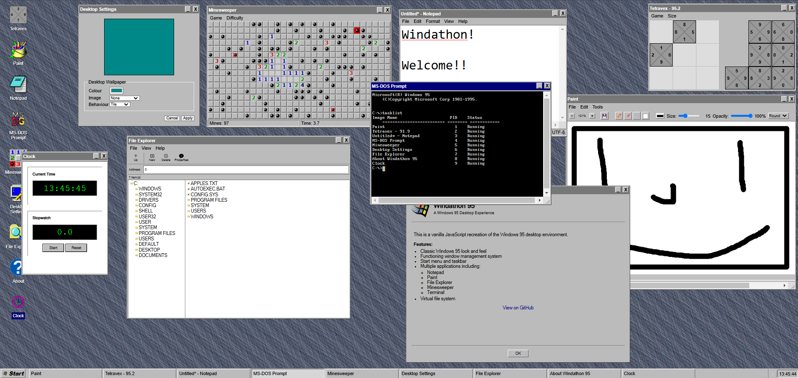
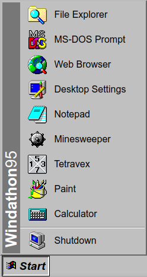
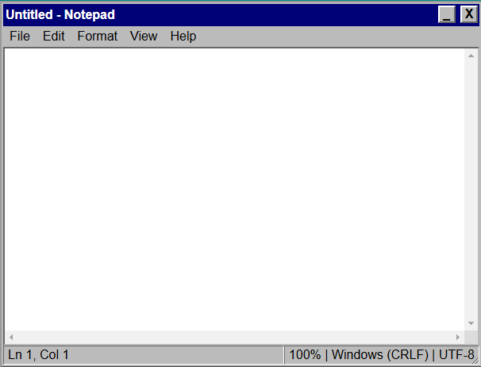
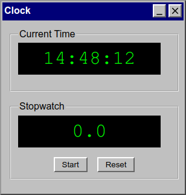

# Windathon-95 - Our hackathon project

A faithful recreation of the Windows 95 operating system in vanilla JavaScript, running entirely in the browser.



You can view the live site [here](https://james-adcott-edu.github.io/Windathon-95/).


NOTE: Results were recorded on a powerful machine, your results may vary.

## 🚀 Features

- Classic Windows 95 UI with working windows, taskbar, and start menu
- Multiple built-in applications (found in the `assets/js/modules/apps/` directory):
  - Notepad (with full text editing capabilities)
  - MS-DOS Prompt (command-line interface)
  - Minesweeper
  - Paint
  - Tetravex
  - File Explorer
- Draggable and resizable windows
- File system simulation using localStorage
- Authentic Windows 95 styling and interactions

### Site Goals
- Provide a semi-faithful recreation of the Windows 95 experience
- Have fun building it!

### Design Choices
- We tried to go as close to Windows-95 as possible.
- We haven't focused on a mobile experience, as it's a desktop operating system.

### User Stories

We kept the user stories in the kanban board, which can be found [here](https://github.com/users/james-adcott-edu/projects/5).

### Wireframes
- Initial wireframes were created to map out the desktop layout, taskbar, and application windows.
- Iterative design process to refine the user interface based on feedback.

### Additional Information
- The design process focused on balancing authenticity with modern web standards.
- User feedback was incorporated to improve usability and functionality.

## 🛠️ Technical Details

### Core Components

- **Desktop Environment**: Main orchestrator managing the OS simulation
- **File System**: Virtual file system using localStorage
- **Window Manager**: Handles window creation, movement, and resizing
- **Application Framework**: Base class for all applications, providing common functionality
- **Config**: Simple configuration file to account for different environments.

#### Desktop Environment

This is the main component that orchestrates the desktop environment. It manages the taskbar, start menu, and the overall layout of the desktop. It's essentially a monolithic class that handles all the interactions and updates the DOM accordingly.

This includes a start menu, which is a simple menu in the bottom left of the screen.


We also have a taskbar, which includes a clock, with active applications pinned to it.
If the clock is clicked, the clock application will open. It also contains a system tray, which includes an audio slider (which doesn't do anything), and a network indicator. The network indicator will turn red if you're offline, and grey if you're online.


#### Scoped CSS

We use scoped CSS to allow applications to add their own styles without affecting the global styles. This is useful for applications to have their own look and feel, while still being part of the Windows 95 theme.

This was implemented by James, and works by assigning the window a unique ID, and then adding that ID to the style tag for that window. This allows the styles to be scoped to the window, and not affect the global styles.

#### File System (jsonfs)

This is a simple file system that uses localStorage to store the file data. It's a basic implementation of a file system and is not a full-fledged file system like the one in Windows 95. It's just a simple way to simulate a file system in the browser.

This allows us to integrate the file system into the applications that we build. Creating true saving functionality, and the ability to load previous states of applications.

We represent the file system with a JavaScript object. Any entry in the object that is another object is treated as a directory, and any entry that is a string is treated as a file. The file system is not case-sensitive, and will automatically convert file paths to lower case.

#### Window Manager

This is the component that handles the windows that are created. It allows us to create, move, and resize windows. It also handles the z-index of the windows, so that windows can be brought to the front by the user.

This class handles the focus of windows, so that when a window is brought to the front, it becomes active and the previous window will be behind by dynamically updating the z-index.

The window manager is also in charge of starting applications, pushing them to the taskbar, and handling the processes that are running.

#### Application Framework

This is the base class for all applications. It provides ways to accept arguments, interact with the desktop environment, and provides a base class for all applications to build upon.

## 💻 Applications

### Notepad


The notepad is a simple text editor that allows you to create and edit text files. It integrates tightly with Explorer, and allows you to open explorer in a different mode to select files to open/save.

It's just a `textarea` element, but with some added functionality to save and open files.

- Full text editing capabilities
- File operations (New, Open, Save, Save As)
- Find/Replace functionality
- Word wrap and font settings
- Integrates with the file system using explorer.
- Status bar showing cursor position, and file size.
- Common insert options (date, time, paste, cut, copy, undo, redo)

### MS-DOS Prompt


The MS-DOS prompt is a command-line interface that attempts to mimic the MS-DOS prompt as closely as possible. It supports many original commands, and integrates with the custom filesystem.

It uses custom command parsing to accept string arguments, so that directorys like `Program Files` are correctly parsed.

- Command-line interface
- Many DOS commands available
- File system navigation
- File operations
- List of commands available
  - `cls` - Clears the screen
  - `dir` - Lists files in the current directory
  - `cd` - Changes the current directory
  - `md` - Creates a directory
  - `mkdir` - Creates a directory
  - `type` - Displays the contents of a file
  - `help` - Displays the help menu
  - `ver` - Displays the version of the DOS prompt
  - `exit` - Exits the DOS prompt
  - `start` - Starts a new application
  - `tasklist` - Lists running tasks
  - `taskkill` - Ends a running task
  - `echo` - Displays a message
  - `programs` - Lists all installed applications

The terminal interacts soley with the JsonFs, and does not have any knowledge of the file system outside of that.

### Minesweeper


Minesweeper is a classic game that allows you to clear cells by revealing what is underneath. If you reveal a mine, you lose! James implemented the game logic from scratch, and it works flawlessly, even allowing you to flag mines to help you solve the puzzle.

- Classic Windows 95 Minesweeper game
- Multiple difficulty levels, including beginner, intermediate, and expert.
- Timer and mine counter using the status bar.
- Full functionality, including the ability to flag mines.
- Game logic written from scratch by james.

### Paint


This is a basic paint application, implemented using the canvas element. It allows you to draw on the canvas with a brush, and has a color picker to change the color of the brush.

It also has tools like undo, line tools and square tools.

- Basic paint application
- Drawing capabilities
- Color picker
- Zoom functionality
- Undo/Redo functionality
- Drawing logic written from scratch by deeton.
- Change size and opacity of the brush, with different brush types.

### Tetravex


Tetravex is a puzzle game where you must rearrange the tiles to match the target grid. It's a classic puzzle game that is easy to pick up and play, but difficult to master.

The algorithm was written by James, and it even includes logic to solve the puzzle automatically!

- Classic puzzle game
- 2D grid with numbered tiles
- Drag and drop functionality
- Offers different grid sizes
- Game logic written from scratch by james.

### File Explorer


The file explorer is a basic file system navigator that allows you to navigate the file system, create new files and directories, and delete files and directories.

It simply recurses through the file system object, and displays all the files and directories.

Double clicking on a file will open it in Notepad, and double clicking on a directory will open it in Explorer.

- File system navigation
- File operations (New, properties, delete)
- File properties
- Integration with other applications, such as Notepad.
- Full functionality, including the ability to create new files and directories.
- Explorer also integrates with the JsonFs, and does not have any knowledge of the file system outside of that.

### Web Browser


This is a simple web browser that uses an iframe to load websites. It saves history, and allows you to search Google directly from the browser.

- Basic web browser with Google search built in.
- Navigate to websites that allow themselves to be embedded.
- Search the web
- Inception mode, which allows you to navigate to this very site, inside the browser itself!
- DuckDuckGo search syntax is supported, so you can easily search from certain websites using the `!` prefix. Example: `Cat video !y` will search youtube for "Cat video".

### Calculator


This is a basic calculator with a sleek Windows 95 design. It performs addition, subtraction, multiplication, and division.

### Clock


This is a simple clock application that shows the current time and date. It has a stopwatch feature, which can be started and stopped. It opens when clicking on the clock in the system tray.

### About

- A simple about application that shows information about the operating system.

## Known Bugs 🐛
- The web browsers history is not saved between sessions. 
- The web browsers history can easily be corrupted, meaning it can stop navigating back and forth properly.
- Using a square brush in paint causes some strange rendering issues. (The squares jump around the line)
- Sometimes (The trigger is unknown) the notepad textarea will not accept any input, and will require a hard reload to fix.

## Future Improvements 🧠

- Make the desktop integrated with the file system, so applications can be deleted and installed to the desktop easily.
- Make the window resizing more intuitive.
- Make the taskbar more integrated with the file system, so that applications can be pinned to the taskbar.
- Implement a proper security system, so that the web browser can detect if a website is secure or not.

## 📦 Deployment

### GitHub Pages Deployment

1. Fork this repository
2. Go to your fork's Settings > Pages
3. Set the source branch to `main`
4. Set the folder to `/ (root)`
5. Save your changes
6. Your site will be available at `https://[your-username].github.io/windows95-clone/`

### Traditional Web Server Deployment

1. Clone the repository:
```bash
git clone https://github.com/james-adcott-edu/Windathon-95
```

2. Deploy using a local development server:
```bash
# Using Python
python -m http.server 8000
```

3. For production deployment:
   - Minify the files, remove comments, and other non-essential content
   - Upload the files to your web hosting service
   - Ensure all files maintain their directory structure
   - Configure your web server to serve `index.html` as the default page

### Requirements

- The application requires no build process or dependencies
- All assets must maintain their relative paths
- Web server must support:
  - Serving static files
  - JavaScript modules (ES6)
  - Local Storage API

### Cross-Origin Considerations

If deploying to a custom domain:
1. Ensure all resource paths are relative
2. Update `web_root` in `assets/js/Config.js` if necessary
3. Configure CORS headers if serving assets from a different domain

### Troubleshooting

- If images don't load, check the `web_root` configuration in `Config.js`
- If storage doesn't work, ensure localStorage is enabled
- For CORS issues, verify your server's security headers (or just install the no-cors extension for chrome)

## 🔧 Development

### Adding New Applications

1. Create a new application class in `assets/js/modules/apps/`
2. Register the application in `Applications.js`
3. Add corresponding icon in `assets/images/`
  - Please note, the icon full paths are handled by the desktop environment, so you don't need to worry about that.

Example application structure:

```javascript
export default class NewApp {
    constructor(windowObject, windowContent, args) {
        this.window = windowObject;
        this.windowContent = windowContent;
        this.args = args;

        // Provides a way to dynamically set the title of the window
        this.window.setTitle('My New App');
        this.window.setCloseRequest(() => {
            // This is called when the user clicks the close button
            // You can use this to save data, etc. (its effectively a destructor)
            this.window.closeWindow();
        });
        // Add scoped styles to the window
        this.window.addStylesheet('.custom-style { color: red; }');
        this.setupUI();
    }

    setupUI() {
        // Application-specific UI setup
        // easily add HTML here
        this.windowContent.innerHTML = '<h1>Hello World</h1>';
    }
}
```

## 🧪 Testing

### Manual Testing
- Each application has been thoroughly tested for functionality and user interaction, though some may be buggy.
- Window management system tested for proper focus handling and dragging.
- Start menu and taskbar interactions verified across different scenarios
- File system operations tested for data persistence and proper error handling

In the development environment, there's a large red bar at the top of the page to signify it's the development environment. This is to help with debugging, and will not be present in the production environment.

For testing, you just run the development server (`python -m http.server 8000` or similar) and navigate to the site at (`localhost:YOUR_PORT_NUMBER` - with `YOUR_PORT_NUMBER` being the port number you used to run the server).

Everything is client side, so just press Ctrl+Shift+I to open the dev tools and you can test everything that the user would be able to test. We used the console when debugging applications. 

### Responsive Testing
- Interface tested across multiple screen sizes and resolutions, however the experience is not optimal on mobile devices. This is designed to be a retro desktop experience after all.

### User Story Testing
| User Story | Test | Result |
|------------|------|---------|
| As a user, I want to explore the Windows 95 interface | Tested navigation through start menu, desktop icons, and windows | ✅ Pass |
| As a user, I want to save and load files | Tested file operations in Notepad and other applications | ✅ Pass |
| As a developer, I want to understand the architecture | Reviewed code organization and documentation | ✅ Pass |

### Validation Testing
- JavaScript code linted using ESLint
- CSS validated using W3C CSS Validator
- HTML validated using W3C Markup Validator

#### W3C HTML validation


#### W3C CSS validation


### Known Bugs
- Window maximize behavior may be inconsistent on some screen sizes
- Some keyboard shortcuts may conflict with browser defaults
- File system has limited storage capacity due to localStorage limitations
- Some application features may be buggy.

### Fixed Bugs
- Resolved window focus issues when multiple windows are open
- Fixed taskbar button alignment on smaller screens
- Corrected file system path handling for case-sensitive operations

### Future Improvements
- Add more applications, such as Internet Explorer (using an iframe)
- Allow windows to be resized from any side.

## 📝 License

This project is intended for educational purposes only. Windows 95 is a trademark of Microsoft Corporation.

## 🙏 Acknowledgments

- Microsoft for the original Windows 95
- Contributors to the project (james and deeton)
- The web development community for resources and inspiration
- Icons from Google Images, the specific sources are as follows:
  - [Wikipedia](https://en.wikipedia.org)
  - [Logopedia](https://logos.fandom.com/wiki/Logopedia)
  - [Free Icons](https://freeicons.io)
  - [FreePik](https://freepik.com)
  - [SVG Repo](https://www.svgrepo.com)
- The terminal font: [Perfect DOS VGA 437](https://www.dafont.com/perfect-dos-vga-437.font)
